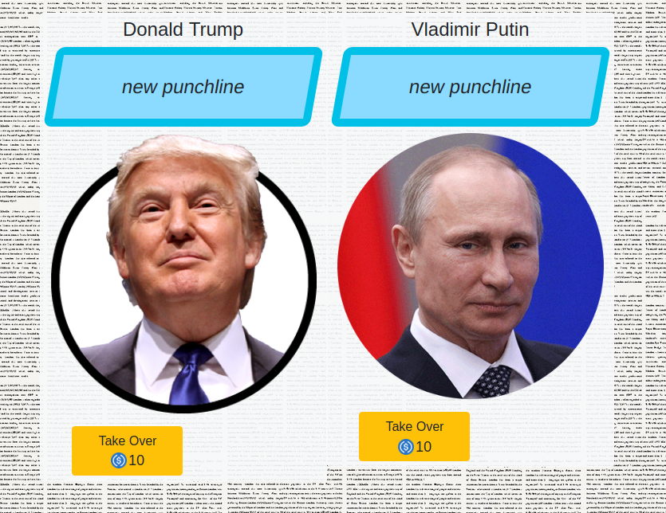

# _YFNFT_

## NFT you can't buy, you can't farm, it has to be won!

------------

##  How to mint?

You see a list of Persons / NFT templates:

You choose, customize and pay to premint an NFT. This costs 10 USDC.

Your preminted NFT appears on dApp homepage and can be liked / voted on.

And the end of a wekely round most voted NFT gets minted. The rest of perminted NFTs gets discarded.

## How to play?

Vote for NFT the be minted, this costs 1 USDC.

If you vote for NFT that ends up in Top 5 you qualify for a prize.

## How is prize calculated?

90% of turnover goes to prizepool. These are both minting and voting fees.

At the end of the round prize pool gets propotionaly distributed to players voting for Top 5 NFTs.

-----------
©️ Fox Reymann Limited 2020
Company registered in England and Wales. No. 7914149
