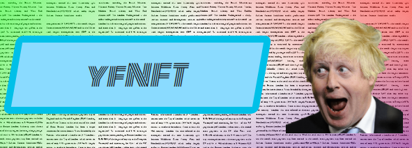
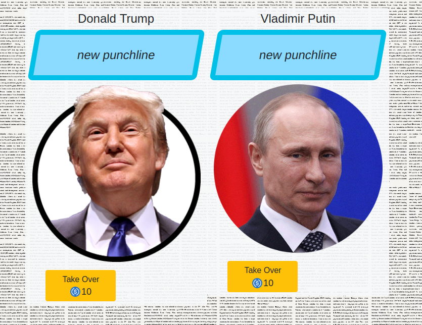

## NFT you can't buy, you can't farm, it has to be won!

Design an NFT, fight for most likes, win an NFT and the prize

------------

##  How to design an yfNFT?

Go to Design section

You see a list of NFT templates:

You choose a template, create a meme / punchline  to design an NFT.

Your NFT appears on the app homepage and can be liked / voted on.

And the end of a wekely round most voted NFT gets created / minted. Winner gets the NFT plus double his payment.

The rest of designs gets discarded.

## How much does it cost to design an yfNFT?

First designer pays 10 MATIC and then each next designer pay 10% more. That way the app won't get flooded with too many designs.

## How to like an yfNFT.

Click the Like button next to the best NFT. Your like costs 1 MATIC. If the liked NFT will be the winning one you are going to win the NFT. If the liked NFT won't be the winning one, you get your 1 MATIC back.

-----------
©️ Fox Reymann Limited 2020
Company registered in England and Wales. No. 7914149
